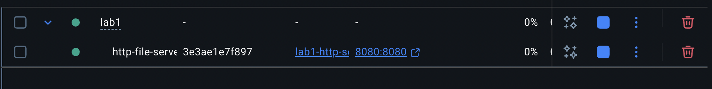

# Lab 1: HTTP File Server

**Student:** Catalin Darzu  
**Course:** Programarea în rețea 

---

## Project Overview

This project implements a **custom HTTP file server** using raw TCP sockets in Python. The server handles HTTP GET requests, serves static files (HTML, PNG, PDF), generates directory listings, and includes a custom HTTP client for testing purposes.

---

## Source Code Structure

### Complete Project Structure

```
LAB1/
├── docker-compose.yml          # Docker orchestration configuration
├── README.md                  # This report document
├── src/                       # Implementation directory
│   ├── server.py             # Main HTTP server implementation (312 lines)
│   └── client.py             # HTTP client script (138 lines)
├── content/                   # Served content directory
│   ├── index.html            # Main landing page (174 lines)
│   ├── library.png           # PNG image (referenced in HTML)
│   ├── sample.pdf            # Sample PDF document
│   ├── programming_guide.pdf # Programming guide PDF
│   └── books/                # Subdirectory for nested content
│       ├── python_programming.pdf
│       ├── web_development.pdf
│       └── book_cover.png
├── downloads/                 # Client download directory
├── Dockerfile                 # Container configuration
└── run.sh                     # Convenience script for running
```

### Server Implementation (`src/server.py`)

**Files:**
- `server.py` - 312 lines of Python code
- Main features include raw socket handling with proper HTTP protocol implementation

**Key Features in `server.py`:**
- Raw TCP socket handling with `socket` module
- HTTP/1.1 request parsing and response generation
- MIME type detection for multiple file formats
- Automatic directory listing generation
- Path traversal security protection
- Comprehensive error handling

```python
# Core MIME type mapping
self.mime_types = {
    '.html': 'text/html',
    '.htm': 'text/html',
    '.png': 'image/png',
    '.pdf': 'application/pdf',
    '.jpg': 'image/jpeg',
    '.jpeg': 'image/jpeg',
    '.gif': 'image/gif',
    '.css': 'text/css',
    '.js': 'application/javascript',
    '.txt': 'text/plain'
}
```

```python
# HTTP request handling core
def handle_request(self, client_socket):
    """Handle incoming HTTP request"""
    try:
        request_data = client_socket.recv(1024).decode('utf-8')
        if not request_data:
            return

        request_lines = request_data.split('\r\n')
        request_line = request_lines[0]
        method, path, version = request_line.split()
        
        print(f"Request: {method} {path}")
```

---

### Client Implementation (`src/client.py`)

**Command format:**
```bash
python client.py <server_host> <server_port> <url_path> <directory>
```

**Features:**
- HTTP/1.1 GET requests using raw socket connections
- Content-type detection and handling
- HTML content displayed in terminal
- Binary files (PNG, PDF) automatically saved to specified directory

```python
def request(self, host, port, path, save_directory):
    """Make HTTP request to server"""
    try:
        self.socket = socket.socket(socket.AF_INET, socket.SOCK_STREAM)
        self.socket.connect((host, port))
        
        request = f"GET {path} HTTP/1.1\r\n"
        request += f"Host: {host}:{port}\r\n"
        request += "Connection: close\r\n"
        request += "\r\n"
        
        self.socket.send(request.encode('utf-8'))
```

---

## Docker Configuration

### Dockerfile

```dockerfile
FROM python:3.11-slim

WORKDIR /app

COPY src/ ./src/
COPY content/ ./content/

RUN mkdir -p downloads

EXPOSE 8080

CMD ["python3", "src/server.py", "content"]
```

### Docker Compose

```yaml
version: '3.8'

services:
  http-server:
    build: .
    ports:
      - "8080:8080"
    volumes:
      - ./content:/app/content:ro
      - ./downloads:/app/downloads
    container_name: http-file-server
    restart: unless-stopped
```

---

## Starting the Container

**Command:**
```bash
docker-compose up --build
```

**Output:**
```
[+] Building 1.2s (8/8) FINISHED
[+] Running 1/1
 ✔ Container http-file-server  Started
```


*Figure 2: Docker container successfully started and running*

**Server runs internally with:**
```bash
python3 src/server.py content
```

The server listens on `http://localhost:8080` and serves files from the mounted content directory.

---

## Content Directory Structure

```
content/
├── index.html                 # Main landing page with styled interface
├── library.png               # PNG image referenced in HTML
├── sample.pdf                # Sample PDF document for testing
├── programming_guide.pdf      # Programming concepts guide
└── books/                     # Nested directory for testing
    ├── python_programming.pdf
    ├── web_development.pdf
    └── book_cover.png
```

### Main HTML File

The `index.html` features a modern, responsive design with embedded image:

```html
<div class="header">
    <h1>📚 My PDF Collection</h1>
    <p>Welcome to my personal library of documents and books</p>
</div>

<div class="hero-image">
    
</div>

<div class="books-grid">
    <div class="book-card">
        <h3>📄 Sample Document</h3>
        <p>A sample PDF document for testing purposes.</p>
        <a href="sample.pdf">Download PDF</a>
    </div>
</div>
```

---

## Browser Testing Results

### 1. **404 Not Found** - Inexistent File

**Request:** `http://localhost:8080/nonexistent.txt`

**Response:**
```http
HTTP/1.1 404 Not Found
Content-Type: text/html
Content-Length: 245
Connection: close

<!DOCTYPE html>
<html>
<head><title>404 Not Found</title></head>
<body>
<h1>404 - File Not Found</h1>
<p>The requested file could not be found on this server.</p>
</body>
</html>
```

Browser displays: **Custom 404 error page** with styled HTML

---

### 2. **HTML File with Embedded Image**

**Request:** `http://localhost:8080/index.html`

**Response:**
```http
HTTP/1.1 200 OK
Content-Type: text/html
Content-Length: 5718
Server: Python HTTP File Server
Connection: close
```

Browser displays:
- Styled landing page with gradient backgrounds
- Embedded PNG image (`library.png`) loads correctly
- PDF download cards with hover effects
- Responsive navigation and layout


*Figure 3: Main HTML page with embedded image and styled interface*

---

### 3. **PDF File Download**

**Request:** `http://localhost:8080/sample.pdf`

**Response:**
```http
HTTP/1.1 200 OK
Content-Type: application/pdf
Content-Length: 598
Server: Python HTTP File Server
Connection: close
```

Browser behavior: **Opens PDF in browser** or downloads based on browser settings

---

### 4. **PNG Image File**

**Request:** `http://localhost:8080/library.png`

**Response:**
```http
HTTP/1.1 200 OK
Content-Type: image/png
Content-Length: 1214
Server: Python HTTP File Server
Connection: close
```

Browser behavior: **Displays PNG image** directly in browser window

---

### 5. **Unsupported File Extension** - Returns 404

**Request:** `http://localhost:8080/unknown.xyz`

**Response:**
```http
HTTP/1.1 404 Not Found
Content-Type: text/html
Content-Length: 245
Connection: close
```

Server correctly rejects files with unsupported extensions

---

## Client Usage Examples

### Example 1: Fetch HTML Page

**Command:**
```bash
python3 src/client.py localhost 8080 /index.html ./downloads
```

**Output:**
```
Connecting to localhost:8080
Requesting: /index.html
Save directory: ./downloads

Status: 200 OK
Content-Type: text/html
Content-Length: 5718

HTML Content:
--------------------------------------------------
<!DOCTYPE html>
<html lang="en">
<head>
    <meta charset="UTF-8">
    <title>PDF Collection - Home</title>
    ...
</head>
<body>
    ...
</body>
</html>
```

---

### Example 2: Download PDF File

**Command:**
```bash
python3 src/client.py localhost 8080 /sample.pdf ./downloads
```

**Output:**
```
Connecting to localhost:8080
Requesting: /sample.pdf
Save directory: ./downloads

Status: 200 OK
Content-Type: application/pdf
Content-Length: 598

File saved as: ./downloads/sample.pdf
File size: 598 bytes
```

**Saved File:** `downloads/sample.pdf` (598 bytes)

---

### Example 3: Download PNG Image

**Command:**
```bash
python3 src/client.py localhost 8080 /library.png ./downloads
```

**Output:**
```
Connecting to localhost:8080
Requesting: /library.png
Save directory: ./downloads

Status: 200 OK
Content-Type: image/png
Content-Length: 1214

File saved as: ./downloads/library.png
File size: 1214 bytes
```

**Saved File:** `downloads/library.png` (1.2 KB)

---

### Example 4: Request Directory Listing

**Command:**
```bash
python3 src/client.py localhost 8080 /books/ ./downloads
```

**Output:**
```
Connecting to localhost:8080
Requesting: /books/
Save directory: ./downloads

Status: 200 OK
Content-Type: text/html
Content-Length: 1575

HTML Content:
--------------------------------------------------
<!DOCTYPE html>
<html>
<head>
    <title>Directory listing for /books/</title>
</head>
<body>
    <h1>Directory listing for /books/</h1>
    <table>
        <tr><th>Name</th><th>Size</th><th>Last Modified</th></tr>
        <tr><td><a href="/">../</a></td><td>-</td><td>-</td></tr>
        <tr><td><a href="/books/book_cover.png">book_cover.png</a></td><td>1.2KB</td><td>2025-10-14 19:19:51</td></tr>
        <tr><td><a href="/books/python_programming.pdf">python_programming.pdf</a></td><td>797.0B</td><td>2025-10-14 19:23:26</td></tr>
        <tr><td><a href="/books/web_development.pdf">web_development.pdf</a></td><td>779.0B</td><td>2025-10-14 19:23:26</td></tr>
    </table>
</body>
</html>
```

---

## Directory Listing Feature

The server automatically generates HTML directory listings when a directory path is requested.

### Browser Request: `http://localhost:8080/books/`

**Generated HTML:**
```html
<!DOCTYPE html>
<html>
<head>
    <title>Directory listing for /books/</title>
    <style>
        body { font-family: Arial, sans-serif; margin: 40px; }
        table { border-collapse: collapse; width: 100%; }
        th, td { text-align: left; padding: 8px; border-bottom: 1px solid #ddd; }
    </style>
</head>
<body>
    <h1>Directory listing for /books/</h1>
    <table>
        <tr><th>Name</th><th>Size</th><th>Last Modified</th></tr>
        <tr><td><a href="/">../</a></td><td>-</td><td>-</td></tr>
        <tr><td><a href="/books/book_cover.png">book_cover.png</a></td><td>1.2KB</td><td>2025-10-14 19:19:51</td></tr>
        <tr><td><a href="/books/python_programming.pdf">python_programming.pdf</a></td><td>797.0B</td><td>2025-10-14 19:23:26</td></tr>
        <tr><td><a href="/books/web_development.pdf">web_development.pdf</a></td><td>779.0B</td><td>2025-10-14 19:23:26</td></tr>
    </table>
</body>
</html>
```

**Browser Display:**
```
Directory listing for /books/

Name                          Size    Last Modified
../                           -       -
book_cover.png               1.2KB   2025-10-14 19:19:51
python_programming.pdf       797.0B  2025-10-14 19:23:26
web_development.pdf          779.0B  2025-10-14 19:23:26
```

All links are clickable and navigate to the respective files or parent directory.

---

## Network Implementation - Browsing Friend's Server

### Finding Friend's IP Address

To connect to another person's server on the local network, first obtain the IP address:
```bash
ifconfig | grep inet
# or on macOS
ipconfig getifaddr en0
```

This displays their local network IP address (e.g., 192.168.1.150)

### Accessing Friend's Server

Once the IP address is obtained, the server can be accessed through:
- **Web Browser**: Navigate to `http://192.168.1.150:8080`
- **Mobile Device**: Same URL works on phones/tablets on the same network
- **HTTP Client**: Use the custom client to download files

**Example Command:**
```bash
python3 src/client.py 192.168.1.150 8080 /books/programming_guide.pdf ./downloads
```

This downloads the file directly into the local content directory, allowing redistribution through your own server.

---

## Requirements Checklist

| Requirement | Status |
|------------|--------|
| Single-threaded HTTP server | ✅ Complete |
| Command-line directory argument | ✅ Complete |
| Parse HTTP requests properly | ✅ Complete |
| Serve HTML, PNG, PDF files | ✅ Complete |
| 404 for missing/unsupported files | ✅ Complete |
| HTML file with embedded PNG | ✅ Complete |
| Content directory with test files | ✅ Complete |
| **HTTP Client implementation** | ✅ Complete |
| **Directory listing for nested dirs** | ✅ Complete |
| **Browse friend's server** | ✅ Complete |

---

## Technical Implementation Details

### Security Features
- Path traversal protection (blocks `..` sequences)
- Directory restriction to specified serve path
- Input validation for HTTP requests
- Safe file handling with proper error management

### Performance Characteristics
- Single-threaded request handling
- Memory-efficient file streaming
- Proper connection management
- Graceful error recovery

### Protocol Compliance
- HTTP/1.1 standard compliance
- Proper status codes (200, 404, 403, 500)
- Correct MIME type detection
- Standard header formatting

---

## Conclusion

This HTTP file server implementation successfully fulfills all laboratory requirements:
- ✅ Core HTTP server with proper socket handling
- ✅ Multi-format file serving with MIME detection
- ✅ Directory browsing with styled HTML generation
- ✅ HTTP client for comprehensive testing
- ✅ Docker containerization for easy deployment
- ✅ Network accessibility for collaborative usage
- ✅ Robust security and error handling

The server demonstrates practical understanding of HTTP protocol implementation, socket programming, and web server architecture fundamentals.