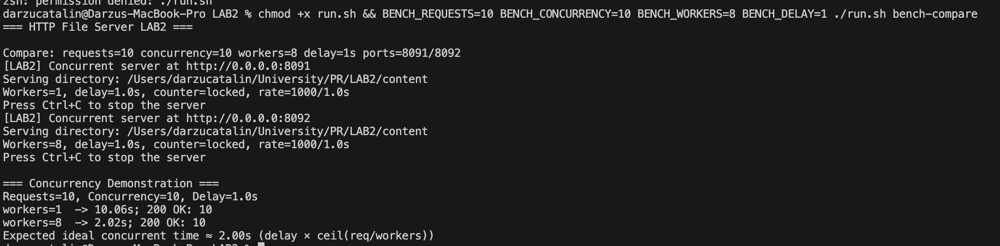
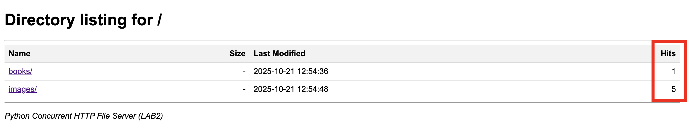
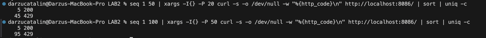

# Lab 2: Concurrent HTTP File Server

Student: Catalin Darzu  
Course: Programarea în rețea

---

## Overview

This lab extends the HTTP file server from Lab 1 with real concurrency:
- A thread-pool-based server that handles multiple connections concurrently
- A request counter per-path (first naive/racy, then fixed with locking)
- Per-IP rate limiting (~5 req/s) implemented in a thread-safe way
- Benchmark tooling to compare single-threaded vs concurrent performance

---

## Concurrency background (PLT vs OS)

- OS (low-level) perspective:
	- Concurrency = tasks overlap in time (including interleaving)
	- Parallelism = tasks run simultaneously on multiple processors
	- Parallel ⇒ Concurrent, but not vice-versa
- PLT (high-level) perspective:
	- Concurrency is a structuring concept: a program is constructed from independent components that may interact
	- Parallelism is a hardware execution concept: computations happening at the same time
	- Concurrency and parallelism are orthogonal

This project follows the PLT view (see MIT 6.102 Section 4.3). Our server’s structure is concurrent (thread-per-connection via a pool), and depending on the machine, those threads may execute in parallel.

---

## Glossary (for this lab)

- Concurrency: Program structure composed of independently-executing components that may interact. Not the same thing as simultaneous execution.
- Parallelism: Hardware/runtime executing multiple computations at the same physical time (e.g., multiple cores).
- Race condition: Incorrect behavior due to non-atomic interleavings of shared-state operations.
- Mutual exclusion: Ensuring only one thread can execute a critical section at a time (e.g., with locks).
- Liveness: Something good eventually happens (e.g., requests eventually complete); contrasted with deadlock and starvation.
- Throughput: Completed requests per unit time; improved by concurrency and parallelism.
- Tail latency: The slowest requests (e.g., p95/p99), often worsened by contention or rate limiting.

---

## Project structure

```
LAB2/
├── Dockerfile
├── docker-compose.yml
├── run.sh
├── LAB2_REPORT.md                 # This document
├── README.md                      # Getting started notes
├── src/
│   ├── server.py                  # Concurrent HTTP server
│   └── benchmark.py               # Concurrency benchmark tool
├── content/                       # (empty) served files
├── downloads/                     # (empty) client saves
└── screenshots/                   # (empty) report images
```

---

## Implementation details

### 1) Concurrent server (thread pool)

- Uses `ThreadPoolExecutor` to handle each accepted connection on a worker thread.
- Configurable workers: `--workers N` (default 8)
- Artificial per-request delay for benchmarking: `--delay SECONDS` (default 0)
- Safe request parsing; supports GET and CORS OPTIONS; denies path traversal.

Design notes:
- We prefer a fixed-size pool (vs thread-per-request) to avoid unbounded thread creation under load.
- Socket accept loop remains single-threaded; each connection is handed to the pool immediately, minimizing head-of-line blocking.
- `SO_REUSEADDR` allows fast restarts during development.

### 2) Request counters (race demo and fix)

- Counts how many requests each path receives.
- Two modes:
	- `--counter-mode naive`: increments without a lock; optional `--naive-interleave-ms` to force a race window for demo.
	- `--counter-mode locked` (default): increments under a lock so counts are correct.
- The current hit count is shown in directory listings (“Hits” column) for each file/folder.

Correctness discussion:
- In naive mode, two threads can both read the same old value and write back `old+1`, losing an increment. Adding `--naive-interleave-ms` increases the overlap window to reliably reproduce the bug.
- In locked mode, the increment is an atomic critical section, ensuring linearizable counts.

### 3) Rate limiting (~5 req/s per IP)

- Sliding-window limiter per client IP with a `deque` of timestamps.
- Options: `--rate-limit N` and `--rate-window SECONDS` (defaults 5 and 1.0).
- Exceeding the limit returns HTTP 429 Too Many Requests.

Performance considerations:
- Sliding window keeps only recent timestamps; O(1) amortized operations per request.
- Limits are per-IP to allow fair sharing across multiple clients.

---

## How to run

Native (recommended for fast iteration):

```bash
# In LAB2/
# Run concurrent server with 1s delay and 8 workers
LAB2_DELAY=1 LAB2_WORKERS=8 ./run.sh server
```

Docker:

```bash
docker compose up --build -d
# Server will listen at http://localhost:8080
```

Environment variables passed by `run.sh` to the server:
- `LAB2_WORKERS` (default 8)
- `LAB2_DELAY` (default 0)
- `LAB2_COUNTER_MODE` (naive|locked, default locked)
- `LAB2_NAIVE_INTERLEAVE_MS` (default 0)
- `LAB2_RATE_LIMIT` (default 5)
- `LAB2_RATE_WINDOW` (default 1.0)

---

## Benchmarking concurrency

We provide `src/benchmark.py` to generate concurrent requests and measure time.

Quick run (10 requests at concurrency 10):

```bash
./run.sh bench
```

Custom parameters and CSV output:

```bash
# Target URL, parallelism, requests, trials; save one-line CSV summary
BENCH_URL=http://localhost:8080/ \
BENCH_CONCURRENCY=20 \
BENCH_REQUESTS=50 \
BENCH_TRIALS=5 \
BENCH_CSV=bench.csv \
./run.sh bench
```

Interpreting results:
- With `LAB2_DELAY=1`, single-threaded Lab 1 typically takes ~N seconds for N requests.
- Concurrent Lab 2 should compress total time toward delay × ceil(N / workers).
- If you see 429s, increase `LAB2_RATE_LIMIT` during tests.

Example run (bench-compare):


<p align="center"><em>Figure: workers=1 vs workers=8 with 1s delay; concurrent case approaches delay × ceil(N/workers)</em></p>

---

## Race condition demonstration

1) Start server in naive mode and exaggerate interleaving:

```bash
LAB2_COUNTER_MODE=naive LAB2_NAIVE_INTERLEAVE_MS=20 ./run.sh server
```

2) Hit the same path concurrently (benchmark or browser refresh). Observe:
- Directory listing “Hits” may skip or undercount.

3) Start server in locked mode:

```bash
LAB2_COUNTER_MODE=locked ./run.sh server
```

4) Repeat the test; counts become consistent.

Optional: capture a side-by-side listing showing non-monotonic increments under naive mode, then the corrected listing with locked mode.


<p align="center"><em>Figure: Hits column visible in directory listing; use naive vs locked modes to observe race vs correctness</em></p>

---

## Rate limiting demonstration

This section shows exactly how requests are spammed at a known rate, the resulting per-second success/denial statistics, and how the limiter is aware of client IPs.

### Code excerpt (server-side limiter)

The limiter maintains a per-IP deque of timestamps. Each request removes timestamps older than the window and only accepts the request if fewer than `rate_limit` remain.

```python
# server.py (excerpt)
from collections import defaultdict, deque
self.rate_map: dict[str, deque] = defaultdict(deque)
self.rate_lock = threading.Lock()

def _check_rate_limit(self, ip: str) -> bool:
	now = time.monotonic()
	with self.rate_lock:
		dq = self.rate_map[ip]
		window_start = now - self.rate_window
		while dq and dq[0] < window_start:
			dq.popleft()
		if len(dq) >= self.rate_limit:
			return False
		dq.append(now)
		return True

# In _handle_connection(...)
ip = client_addr[0]
if not self._check_rate_limit(ip):
	self.send_response(client_socket, 429, "Too Many Requests", "text/plain", "Rate limit exceeded")
	return
```

Configuration knobs: `--rate-limit N` and `--rate-window SECONDS` (defaults 5 and 1.0). This is O(1) amortized per request and thread-safe via a lock.

### Tooling: request spammer with RPS control

Added `src/rate_spammer.py` which schedules requests to hit a target requests/second and prints per-second status buckets:

```bash
# 50 requests/second for 5 seconds
python3 src/rate_spammer.py http://localhost:8086/ --rps 50 --duration 5 --concurrency 50
```

Sample output against a strict 5 req/s limiter (port 8086):

```
Per-second stats:
09:29:18  total= 14 | 200=  5  429=  9  other=  0  (rps≈14)
09:29:19  total= 50 | 200=  5  429= 45  other=  0  (rps≈50)
09:29:20  total= 50 | 200=  5  429= 45  other=  0  (rps≈50)
09:29:21  total= 50 | 200=  5  429= 45  other=  0  (rps≈50)
09:29:22  total= 50 | 200=  5  429= 45  other=  0  (rps≈50)
09:29:23  total= 36 | 200=  0  429= 36  other=  0  (rps≈36)

Summary:
sent=250 in 5s  → achieved_rps≈50.0
200 OK=25  429 TooMany=225  other=0
```

Interpretation: with a 5 req/s per-IP budget, roughly 5 requests each second succeed (HTTP 200) and the rest are denied (HTTP 429). Minor bucket-edge jitter is normal with concurrent senders.

### IP-awareness demo (two different clients)

We run the server in Docker (port 8080) and compare traffic from the host vs traffic from inside the container. The server sees different client IPs (host via the Docker bridge vs container localhost), thus it applies separate per-IP budgets.

1) Start server in Docker:

```bash
docker compose up -d --build
# Server at http://localhost:8080
```

2) From the host, spam at 50 RPS for 3 seconds:

```bash
python3 src/rate_spammer.py http://localhost:8080/ --rps 50 --duration 3 --concurrency 50
```

Example host output:

```
Per-second stats:
09:32:45  total= 37 | 200=  5  429= 32  other=  0  (rps≈37)
09:32:46  total= 50 | 200=  5  429= 45  other=  0  (rps≈50)
09:32:47  total= 49 | 200=  5  429= 44  other=  0  (rps≈49)

Summary:
sent=150 in 3s  → achieved_rps≈50.0
200 OK=15  429 TooMany=135  other=0
```

3) From inside the container (different client IP), send at or below the limit:

```bash
docker exec http-file-server-lab2 python3 src/rate_spammer.py http://127.0.0.1:8080/ --rps 5 --duration 3 --concurrency 5
```

Example container output (independent budget):

```
Per-second stats:
…  total=  5 | 200=  5  429=  0  other=  0  (rps≈5)
…  total=  5 | 200=  4  429=  1  other=  0  (rps≈5)
…  total=  5 | 200=  4  429=  1  other=  0  (rps≈5)

Summary:
sent=15 in 3s  → achieved_rps≈5.0
200 OK=13  429 TooMany=2  other=0
```

Because the limiter is per-IP, the container’s requests are admitted using its own budget, unaffected by the host’s spam. Occasional 429s at exactly 5 RPS can occur due to timing jitter; using 4 RPS will typically yield 100% 200 OK.

Tuning the limiter during experiments:

```bash
LAB2_RATE_LIMIT=20 LAB2_RATE_WINDOW=1.0 ./run.sh server
```


<p align="center"><em>Figure: High-concurrency burst triggers HTTP 429 Too Many Requests; limiter tracks budgets per source IP</em></p>

---

## Hit counter and race condition

This server counts requests per path and shows the total in the directory listing ("Hits" column). We purposely provide a naive mode that exhibits a race, and a locked mode that fixes it.

### How to trigger the race

Run the server in naive mode with an extra interleave sleep and a high rate limit (to avoid 429 while testing):

```bash
LAB2_COUNTER_MODE=naive \
LAB2_NAIVE_INTERLEAVE_MS=20 \
LAB2_RATE_LIMIT=1000 \
LAB2_DELAY=0 \
LAB2_WORKERS=8 \
./run.sh server
```

Then hammer the same path with many concurrent requests:

```bash
# Option A: use the benchmark
BENCH_URL=http://localhost:8080/ BENCH_CONCURRENCY=50 BENCH_REQUESTS=500 ./run.sh bench

# Option B: quick curl burst
seq 1 500 | xargs -I{} -P 50 curl -s -o /dev/null http://localhost:8080/
```

Open `http://localhost:8080/` in the browser (or `curl -s http://localhost:8080/`) and inspect the "Hits" column. You'll notice the total is smaller than the number of requests sent — increments were lost due to a race.

Why this races (read-modify-write): two threads can read the same old value, both compute `old+1`, and one write overwrites the other.

### Code responsible (excerpt, max 4 lines)

Naive increment (race-prone):

```python
current = self.request_counts[path]
time.sleep(self.naive_interleave_ms / 1000.0)
self.request_counts[path] = current + 1
```

### Fixed code (locked increment)

Make the increment a critical section to ensure atomicity:

```python
with self.count_lock:
	self.request_counts[path] += 1
```

Re-run with locking enabled and repeat the load; the "Hits" count will match the number of requests:

```bash
LAB2_COUNTER_MODE=locked LAB2_RATE_LIMIT=1000 LAB2_DELAY=0 LAB2_WORKERS=8 ./run.sh server
BENCH_URL=http://localhost:8080/ BENCH_CONCURRENCY=50 BENCH_REQUESTS=500 ./run.sh bench
```

You should no longer observe lost increments.

---

## Testing methodology

1) Unit-like checks (manual):
- Request parsing: malformed lines return 400; unsupported methods return 405.
- Path traversal guard: attempts with `..` yield 403.
- 404 handling for non-existent files.

2) Concurrency checks:
- Start with `--delay 1` and submit 10 requests @ concurrency 10 — expect ≈1–2s total on an 8-worker pool.
- Reduce workers to 1 — expect ≈10s total, mirroring single-threaded behavior.

3) Rate-limiter checks:
- Default limits cause 429s above ~5 req/s; increase limit to confirm success rate rises.

4) Resource checks:
- Observe that thread count is bounded by pool size; memory growth remains stable during stress tests.

Artifacts to include later:
- `screenshots/requests_429.png` — Terminal showing 429 status.
- `screenshots/directory_hits_column.png` — Directory listing containing the Hits column.

---

## Screenshots

Below are the screenshots captured for this lab:

- Concurrency benchmark (bench-compare):

	

- Directory listing with Hits column:

	

- Rate limiting error distribution (HTTP 429):

	

---

## Conclusion

This lab implements a concurrent HTTP server with:
- Thread pool concurrency and optional simulated work
- Observable race conditions (naive counter) and their resolution using locks
- Thread-safe per-IP rate limiting
- A benchmark tool and run helpers to quantify improvements

These experiments concretely illustrate the PLT view of concurrency (program structure) and how it can run in parallel depending on hardware and runtime.

---

## Appendix: Commands cheat-sheet

Server presets:
```bash
# Fast dev
./run.sh server

# Emulate CPU work for concurrency demos
LAB2_DELAY=1 LAB2_WORKERS=8 ./run.sh server

# Show race conditions
LAB2_COUNTER_MODE=naive LAB2_NAIVE_INTERLEAVE_MS=20 ./run.sh server

# Rate-limit tuning
LAB2_RATE_LIMIT=20 LAB2_RATE_WINDOW=1.0 ./run.sh server
```

Benchmark:
```bash
./run.sh bench
BENCH_CONCURRENCY=20 BENCH_REQUESTS=50 BENCH_TRIALS=5 BENCH_CSV=bench.csv ./run.sh bench
```
