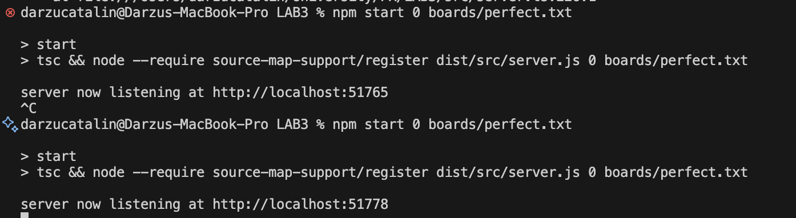
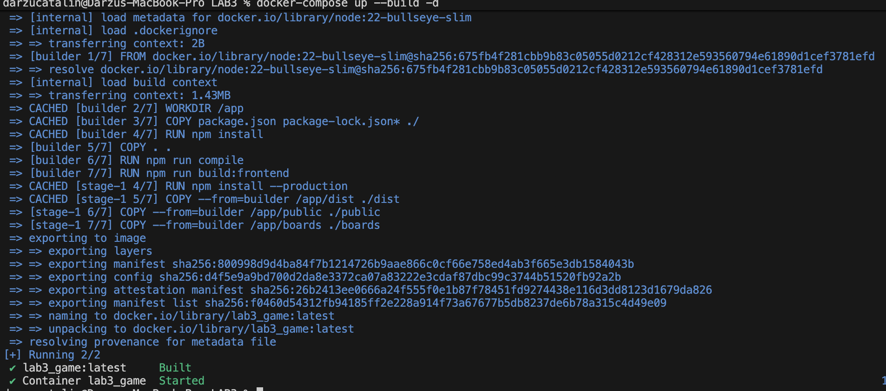
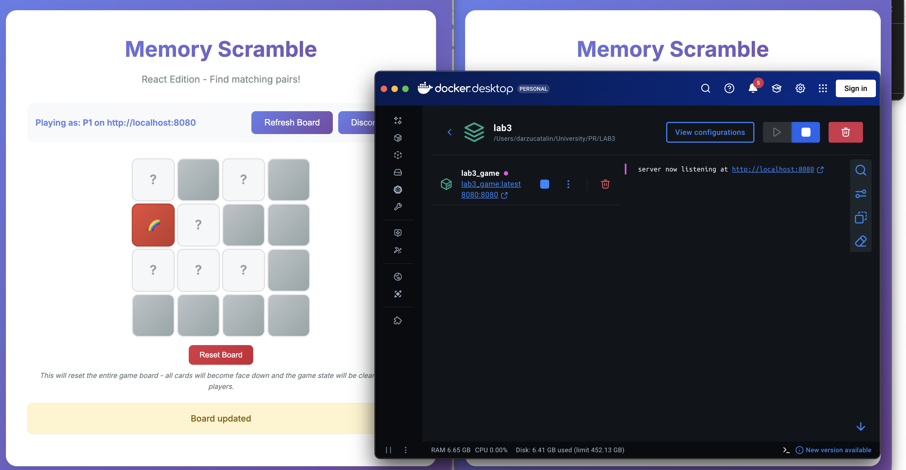
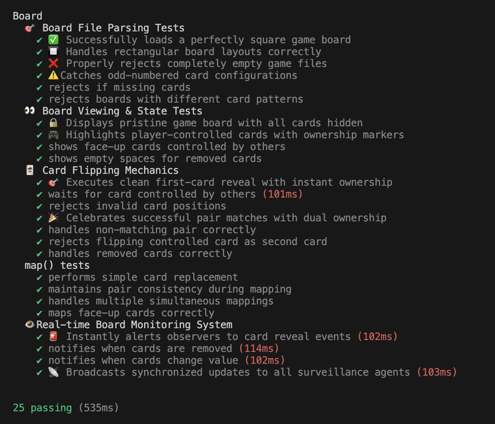

# PR Lab 3 - Enhanced Memory Scramble Game

**Student:** Darzu Catalin, FAF-231  
**Course:** Network Programming (PR)  
**Instructor:** Artiom Balan  
**Deadline:** Nov 11, 2025  

## 1. Overview

This lab implements an enhanced version of the "Memory Scramble" game (based on MIT 6.102 PS4) with a modern React frontend and improved user experience. The server provides a concurrency-aware `Board` abstract data type with HTTP API endpoints, while the frontend offers a polished React-based interface with real-time updates, player color distinction, snackbar notifications, and board reset functionality.

## 2. Objectives

1.  **Enhanced Board ADT:** Implement parsing, validation and core operations (look/flip/map/watch/reset) with correct semantics.
2.  **Modern React Frontend:** Replace static HTML with a responsive React application featuring real-time updates and improved UX.
3.  **Concurrency safety:** Ensure the server behaves correctly when multiple players interact concurrently.
4.  **Advanced Features:** Player color distinction, auto-refresh, snackbar notifications, and board reset functionality.
5.  **Testing & tooling:** Comprehensive unit tests with enhanced descriptions and complete linting coverage.

---
## 3. Project Structure

```
LAB3/
├── Dockerfile                    # Multi-stage Docker build
├── docker-compose.yml            # Container orchestration (lab3_game)
├── package.json                  # Dependencies & scripts
├── vite.config.ts               # React build configuration
├── public/                      # Static assets & compiled React app
├── boards/                      # Example board files for tests and demo
├── frontend/                    # Modern React Frontend
│   ├── src/
│   │   ├── App.tsx             # Main React application
│   │   ├── main.tsx            # React entry point
│   │   ├── index.css           # Enhanced styling with player colors
│   │   ├── styles.css          # Alternative styles
│   │   ├── components/         # React components
│   │   │   ├── GameBoard.tsx   # Interactive game board
│   │   │   ├── ConnectionForm.tsx
│   │   │   ├── PlayerInfo.tsx
│   │   │   ├── ResetBoard.tsx  # Board reset functionality
│   │   │   └── Snackbar.tsx    # Notification system
│   │   └── utils/
│   │       └── boardParser.ts  # Board state parsing
├── src/                         # Backend TypeScript
│   ├── board.ts                # Enhanced Board ADT with reset
│   ├── commands.ts             # API wrappers (look/flip/map/watch/reset)
│   ├── server.ts               # Express server with reset endpoint
│   └── simulation.ts           # Local simulator for manual testing
├── dist/                       # Compiled TypeScript output
└── test/
    └── board.test.ts           # Enhanced unit tests with emojis
```


## 4. Running Locally (No Docker)

### Prerequisites

- Node.js 22+ and npm

### Install and start

```bash
npm install
npm start 0 boards/perfect.txt
```

After startup, the server will choose a random available port. The React frontend is automatically built and served at the server's root URL. Simply open your browser and navigate to `http://localhost:[PORT]` where PORT is displayed in the server output.

### Environment/config options
The server accepts two positional CLI arguments: `PORT` and `FILENAME` (path to board file).

### Screenshot – starting the server


Displays that the server starts up successfully and is available on port 52038.

## 5. Docker Setup

This repository includes a `Dockerfile` and `docker-compose.yml` for quick containerized startup.

### Dockerfile

```dockerfile
FROM node:22-bullseye-slim AS builder

WORKDIR /app

# Install dependencies
COPY package.json package-lock.json* ./
RUN npm install

# Copy source and build both backend and React frontend
COPY . .
RUN npm run compile
RUN npm run build:frontend

# Runtime image: install only production deps
FROM node:22-bullseye-slim
WORKDIR /app
COPY package.json package-lock.json* ./
RUN npm install --production

# Copy built artifacts and static assets
COPY --from=builder /app/dist ./dist
COPY --from=builder /app/public ./public
COPY --from=builder /app/boards ./boards

EXPOSE 8080

CMD ["node", "--require", "source-map-support/register", "dist/src/server.js", "8080", "boards/perfect.txt"]
```

### docker-compose.yml
```yaml
services:
  lab3_game:
    build: .
    image: lab3_game:latest
    container_name: lab3_game
    ports:
      - "8080:8080"
    restart: unless-stopped
    environment:
      - NODE_ENV=production
```

### Build and run with Docker Compose

```bash
docker compose up --build
```

By default the container will listen on port `8080` and load `boards/perfect.txt`. The React frontend is automatically compiled and served at the root URL.

**Container name:** `lab3_game`  
**Access URL:** http://localhost:8080

The React frontend includes:
- 🎨 Modern responsive design with player color distinction
- 🔄 Auto-refresh every 2 seconds for real-time synchronization  
- 📱 Snackbar notifications for user feedback
- 🔁 Board reset functionality
- 🎮 Enhanced user experience with smooth animations

### Screenshot – starting the server with docker


Displays that the docker server starts up successfully.

### Screenshot – accessing the server


Accessing the container via `localhost:8080`.

## 6. Tests, Linting and Simulation

### Lint (TypeScript + ESLint):

```bash
npm run lint
```

### Run unit tests:

```bash
npm test
```

### Screenshot – Enhanced unit tests result


Passing all 25 enhanced tests with distinctive emojis and descriptions:
- 🎯 Board File Parsing Tests
- 👀 Board Viewing & State Tests  
- 🃏 Card Flipping Mechanics
- 👁️ Real-time Board Monitoring System

### Run the simulation script (simple player simulator):

```bash
npm run simulation
```

---
## 7. Key Components

| Component | Purpose |
|---|---|
| `src/board.ts` | Enhanced Board ADT with reset functionality, optimized helper methods, and interfaces. |
| `src/commands.ts` | API wrappers for look/flip/map/watch/reset operations. |
| `src/server.ts` | Express server with new `/reset` endpoint and React frontend serving. |
| `src/simulation.ts` | Example script for simulating multiple players against the board. |
| `frontend/src/App.tsx` | Main React application with state management and real-time updates. |
| `frontend/src/components/` | React components: GameBoard, ConnectionForm, PlayerInfo, ResetBoard, Snackbar. |
| `frontend/src/index.css` | Enhanced CSS with player colors, snackbar system, and responsive design. |
| `frontend/src/utils/boardParser.ts` | Board state parsing utilities for React frontend. |
| `boards/` | Example board files used by tests and demos. |
| `test/board.test.ts` | Enhanced Mocha tests with emoji descriptions and distinctive test names. |
| `vite.config.ts` | React build configuration for frontend compilation. |

---

## 8. Notes and Recommendations

The enhanced `Board` ADT maintains concurrency safety for single-process use while adding reset capabilities. The React frontend provides a modern gaming experience with real-time updates and visual feedback.

**Development Workflow:**
- Local development: `npm start 0 boards/perfect.txt`
- Container development: `docker-compose up --build`
- Testing: `npm test` for enhanced test output
- Linting: `npm run lint` for code quality

**Container Management:**
- Container name: `lab3_game` (more descriptive than default)
- Persistent running: Container stays up until explicitly stopped
- Auto-restart: `unless-stopped` policy for reliability

---
> This README documents the enhanced Memory Scramble Lab 3 project with React frontend and improved user experience.
