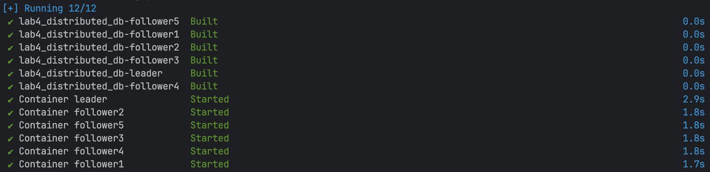
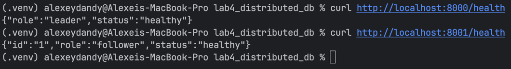
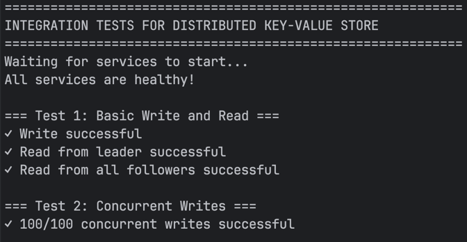
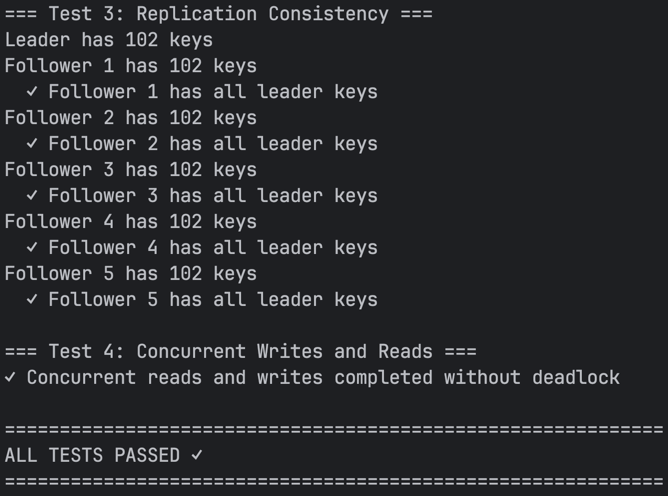
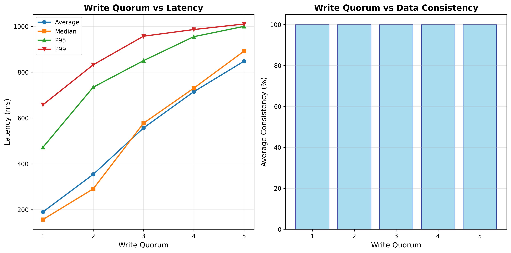

# PR Lab 4: Distributed Key-Value Store with Single-Leader Replication

**Student:** Darzu Catalin, FAF-231  
**Course:** Network Programming (PR)  
**Instructor:** Artiom Balan  
**Deadline:** Dec 01, 2025  

## Description
This project implements a distributed key-value store with single-leader replication, demonstrating concepts from Chapter 5 of "Designing Data-Intensive Applications" by Martin Kleppmann.

## Architecture

- **Leader Node**: Accepts write requests and replicates to followers using semi-synchronous replication
- **Follower Nodes**: 5 followers that receive replicated data and can serve read requests
- **Replication Strategy**: Semi-synchronous with configurable write quorum
- **Communication**: REST API with JSON
- **Deployment**: Docker Compose with separate containers

## Features

- ✅ Single-leader replication (only leader accepts writes)
- ✅ Semi-synchronous replication with configurable write quorum
- ✅ Concurrent request handling on both leader and followers
- ✅ Simulated network lag (0.1ms - 1ms)
- ✅ Concurrent replication to followers
- ✅ Web API with JSON for all operations
- ✅ Environment variable configuration

## Project Structure

```
lab4_distributed_db/
├── leader.py                 # Leader node implementation
├── follower.py              # Follower node implementation
├── docker-compose.yml       # Docker Compose configuration
├── Dockerfile              # Container image definition
├── requirements.txt        # Python dependencies
├── integration_test.py     # Integration tests
├── performance_analysis.py # Performance analysis script
└── README.md              # This file
```

## Prerequisites

- Docker and Docker Compose
- Python 3.11+ (for running tests locally)

## Quick Start

### 1. Build and Start the Cluster

```bash
docker-compose up -d --build
```

This starts:
- 1 leader on port 8000
- 5 followers on ports 8001-8005



### 2. Check Service Health

```bash
curl http://localhost:8000/health
curl http://localhost:8001/health
```



### 3. Test Write Operation

```bash
curl -X POST http://localhost:8000/write \
  -H "Content-Type: application/json" \
  -d '{"key": "test", "value": "hello"}'
```


### 4. Test Read Operation

```bash
# Read from leader
curl http://localhost:8000/read\?key=test

# Read from follower
curl http://localhost:8001/read\?key=test
```

## Configuration

All configuration is done through environment variables in `docker-compose.yml`:

| Variable | Description | Default |
|----------|-------------|---------|
| `WRITE_QUORUM` | Number of follower acknowledgments required | 3 |
| `MIN_DELAY` | Minimum replication delay (seconds) | 0.0001 (0.1ms) |
| `MAX_DELAY` | Maximum replication delay (seconds) | 0.001 (1ms) |

To change the write quorum, edit `docker-compose.yml`:

```yaml
environment:
  - WRITE_QUORUM=4  # Require 4 followers to acknowledge
```

## API Endpoints

### Leader Endpoints

- `POST /write` - Write a key-value pair (only on leader)
  ```json
  {"key": "mykey", "value": "myvalue"}
  ```

- `GET /read?key=<key>` - Read a value by key
- `GET /data` - Get all stored data
- `GET /health` - Health check

### Follower Endpoints

- `POST /replicate` - Receive replication from leader (internal)
  ```json
  {"key": "mykey", "value": "myvalue"}
  ```

- `GET /read?key=<key>` - Read a value by key
- `GET /data` - Get all stored data
- `GET /health` - Health check

## Running Tests

### Integration Tests

```bash
# Install dependencies
pip install -r requirements.txt

# Run integration tests
python integration_test.py
```

The integration tests verify:
1. Basic write and read operations
2. Concurrent writes
3. Replication consistency
4. Concurrent reads and writes




### Race Condition Test (Versioning)
```bash
python test_race_conditions.py
```
A small test script that demonstrates how versioning resolves concurrent write race conditions in a distributed key-value setup. The script performs concurrent writes to the same key and to multiple keys, then verifies that the leader and all followers converge to the same value/version.


### Performance Analysis

```bash
python performance_analysis.py
```

This script:
1. Tests write quorum values from 1 to 5
2. Performs ~100 concurrent writes on 10 keys
3. Measures latency for each configuration
4. Plots results and analyzes performance
5. Checks data consistency across replicas



**Note**: The performance analysis takes ~1-2 minutes to complete as it restarts the cluster for each quorum value.

## Performance Results

### Latency vs Write Quorum

The analysis demonstrates that as the write quorum increases:

- **Lower Quorum (1-2)**: Lower latency but weaker consistency guarantees
- **Higher Quorum (3-5)**: Higher latency but stronger consistency guarantees

This occurs because:
- With higher quorum, the leader waits for more followers to acknowledge
- Even though replication is concurrent, we wait for the slowest required replica
- Network delays compound when waiting for more acknowledgments

### Consistency Analysis

After all writes complete, the system shows:

- **Lower Quorum**: Some followers may lag behind (eventual consistency)
- **Higher Quorum**: Better immediate consistency as more replicas must acknowledge synchronously
- **Eventually**: All followers catch up through asynchronous replication (given enough time)

This demonstrates the **CAP theorem trade-off** between availability and consistency.

## Implementation Details

### Semi-Synchronous Replication

The leader uses a hybrid approach:
1. Writes data to its own store immediately
2. Sends replication requests to all followers concurrently
3. Waits for a configurable number (WRITE_QUORUM) of acknowledgments
4. Returns success to the client once quorum is reached

This provides:
- Better consistency than fully asynchronous replication
- Better availability than fully synchronous replication
- Configurable durability guarantees

### Concurrency

- **Leader**: Uses Flask's threaded mode + ThreadPoolExecutor for concurrent replication
- **Followers**: Use Flask's threaded mode + thread-safe locks for data store access
- **Thread Safety**: All data store operations are protected by locks

### Network Simulation

Simulated network lag is applied before each replication request:
```python
delay = random.uniform(MIN_DELAY, MAX_DELAY)  # 0.1ms - 1000ms
time.sleep(delay)
```

This simulates real-world network conditions and demonstrates the impact of network latency on replication.

## Stopping the Cluster

```bash
docker-compose down
```

To also remove volumes:

```bash
docker-compose down -v
```

## Troubleshooting

### Services not starting

```bash
# Check logs
docker-compose logs leader
docker-compose logs follower1

# Restart services
docker-compose restart
```

### Connection refused errors

Wait a few seconds for services to fully initialize after starting.

### Port already in use

Change the port mappings in `docker-compose.yml`:

```yaml
ports:
  - "6000:5000"  # Use port 6000 instead of 5000
```

## Learning Objectives

This lab demonstrates:

1. **Single-leader replication**: Only one node accepts writes
2. **Semi-synchronous replication**: Balance between consistency and availability
3. **Write quorum**: Configurable durability guarantees
4. **Concurrent operations**: Both reading and writing happen concurrently
5. **Network delays**: Realistic simulation of distributed system challenges
6. **CAP theorem trade-offs**: Consistency vs availability vs partition tolerance
7. **Docker containerization**: Deploying distributed systems with Docker Compose

## References

- "Designing Data-Intensive Applications" by Martin Kleppmann, Chapter 5, Section 1
- CAP Theorem
- Consensus algorithms and quorum-based replication
