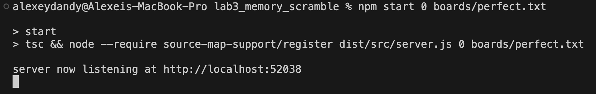
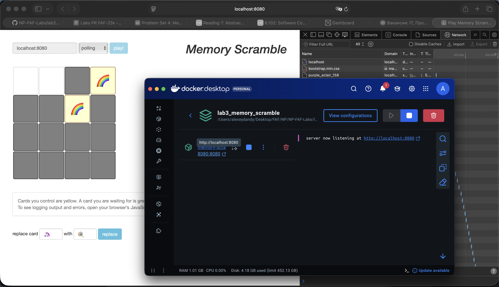
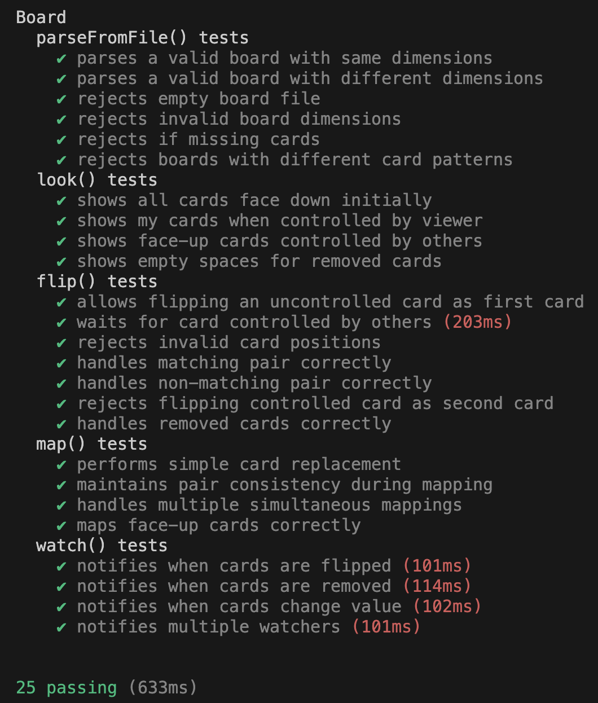

# PR Lab 3 - MIT 6.102 (2025) Memory Scramble lab.

**Student:** Alexei Pavlovschii, FAF-231  
**Course:** Network Programming (PR)  
**Instructor:** Artiom Balan  
**Deadline:** Nov 11, 2025  
**Repository:** [GitHub Link](https://github.com/AlexDandy77/NP-FAF-Labs/)

## 1. Overview

This lab implements the backend for the "Memory Scramble" game (based on MIT 6.102 PS4). The server provides a small, concurrency-aware `Board` abstract data type that works with an HTTP API used by the provided frontend (`public/index.html`). The goal is to implement correct game semantics for look/flip/replace/watch operations, handle basic concurrency between players, and provide a runnable server with tests.

## 2. Objectives

1.  **Board ADT:** Implement parsing, validation and the core operations (look/flip/map/watch) with correct semantics.
2.  **Concurrency safety:** Ensure the server behaves correctly when multiple players interact concurrently.
3.  **Testing & tooling:** Provide unit tests and linting to ensure correctness and maintainability.

---
## 3. Project Structure

```
lab3_memory_scramble/
├── Dockerfile
├── docker-compose.yml
├── package.json
├── public/             # Frontend UI (single static HTML file)
├── boards/             # Example board files used in tests and demo
├── src/
│   ├── board.ts        # Board ADT implementation
│   ├── commands.ts     # API wrappers (look/flip/map/watch)
│   ├── server.ts       # Express web server
│   └── simulation.ts   # Local simulator for manual play
├── dist/               # Compiled output (generated)
└── test/
	└── board.test.ts   # Unit tests for Board
```


## 4. Running Locally (No Docker)

### Prerequisites

- Node.js 22+ and npm

### Install and start

```bash
npm install
npm start 0 boards/perfect.txt
```

After startup, the server will choose the random available port and you will be able to access the UI by opening `public/index.html` and introducing the connection credentials in format `ip:port` at the input box, where `ip` is the ip-address of the machine running the server instance and the `port` is the port chosen by server.

### Environment/config options
The server accepts two positional CLI arguments: `PORT` and `FILENAME` (path to board file).

### Screenshot – starting the server


Displays that the server starts up successfully and is available on port 52038.

## 5. Docker Setup

This repository includes a `Dockerfile` and `docker-compose.yml` for quick containerized startup.

### Dockerfile

```dockerfile
FROM node:22-bullseye-slim AS builder

WORKDIR /app

# Install dependencies
COPY package.json package-lock.json* ./
RUN npm install

# Copy source and build
COPY . .
RUN npm run compile

# Runtime image: install only production deps
FROM node:22-bullseye-slim
WORKDIR /app
COPY package.json package-lock.json* ./
RUN npm install --production

# Copy built artifacts and static assets
COPY --from=builder /app/dist ./dist
COPY --from=builder /app/public ./public
COPY --from=builder /app/boards ./boards

EXPOSE 8080

CMD ["node", "--require", "source-map-support/register", "dist/src/server.js", "8080", "boards/perfect.txt"]
```

### docker-compose.yml
```docker
services:
  memory-scramble:
    build: .
    image: memory-scramble:latest
    ports:
      - "8080:8080"
    restart: unless-stopped
```

### Build and run with Docker Compose

```bash
docker compose up --build
```

By default the container will listen on port `8080` and load `boards/perfect.txt`.

If you prefer to override the command in Compose, the service runs the same command as the local startup:

```yaml
command: ["node", "--require", "source-map-support/register", "dist/src/server.js", "8080", "boards/perfect.txt"]
```

### Screenshot – starting the server with docker


Displays that the docker server starts up successfully.

### Screenshot – accessing the server


Accessing the container via `localhost:8080`.

## 6. Tests, Linting and Simulation

### Lint (TypeScript + ESLint):

```bash
npm run lint
```

### Run unit tests:

```bash
npm test
```

### Screenshot – unit tests result


Passing all 25 tests for parseFromFile, look, flip, map, and watch functions.

### Run the simulation script (simple player simulator):

```bash
npm run simulation
```

---
## 7. Key Components

| Component | Purpose |
|---|---|
| `src/board.ts` | Core ADT implementing the game board and game rules (parsing, state management). |
| `src/commands.ts` | Thin wrappers used by the server and simulation for look/flip/map/watch operations. |
| `src/server.ts` | Express server exposing the HTTP API used by the frontend. |
| `src/simulation.ts` | Example script that simulates one or more players against the board for manual testing. |
| `public/index.html` | Reference front-end UI for playing the game. |
| `boards/` | Example board files used by tests and demos. |
| `test/board.test.ts` | Mocha tests for the Board ADT and its operations. |

---
## 8. Notes and Recommendations

The `Board` ADT is implemented to be concurrency-friendly for single-process use (suitable for this lab). For production or multi-process deployments consider persistent storage and distributed coordination.

The Docker image installs production dependencies and runs the compiled `dist` JS output. When developing, prefer running locally (`npm start`) to iterate quickly.

If you update dependencies, rebuild the Docker image: `docker compose up --build`.

---
> This README documents the implementation and steps to run and test the Memory Scramble Lab 4 project.
